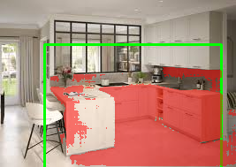

# TP1

## 1

### c

le lien du dépot : https://github.com/Younnnsss
endroit d'exécution : slurm

└── TP1
    ├── data
    │   └── images
    ├── outputs
    │   ├── logs
    │   └── overlays
    ├── README.md
    ├── report
    │   └── report.md
    ├── requirements.txt
    └── src
        ├── app.py
        ├── geom_utils.py
        ├── sam_utils.py
        └── viz_utils.py

### e

Résultat de la commande : 
torch 2.10.0+cu128
cuda_available True
device_count 1

### g

yboutkrida@arcadia-slurm-node-1:~$ python -c "import streamlit, cv2, numpy; print('ok'); import segment_anything; print('sam_ok')"
ok
sam_ok

### i

port choisi : 8888

UI accessible via SSH tunnel : oui

## 2

### b

im1.jpeg — Objet unique bien visible sur fond simple (cas simple, segmentation facile).
im2.jpeg — Objet principal complexe mais isolé (PC), bon contraste global.
im4.jpeg — Scène de rue avec plusieurs objets et arrière-plan chargé (cas complexe).
im6.jpeg — Cuisine avec de nombreux éléments et plans visuels (cas chargé).
im7.jpeg — Grillage fin et répétitif, contours difficiles à segmenter (cas difficile).

## 3

Model : sam_vit_h_4b8939.pth

yboutkrida@arcadia-slurm-node-1:~/deeplearning-advanced$ python TP1/src/quick_test_sam.py 
img (189, 267, 3) mask (189, 267) score 0.8512305021286011 mask_sum 9058

L'inférence s'exécute correctement : le modèle `sam_vit_h_4b8939.pth` se charge sur GPU et génère un masque binaire avec une résolution identique à celle de l'image d'entrée.
Avec ce modèle ViT-H, le temps d'exécution est suffisamment rapide pour une utilisation interactive via l'interface Streamlit.
La précision du masque dépend considérablement de la qualité de la bounding box fournie : une box imprécise peut inclure des zones non pertinentes.
Le mode multimask est particulièrement utile dans des cas ambigus, bien qu'une fonctionnalité pour sélectionner automatiquement le meilleur masque reste nécessaire.

## 4

Suite à des problème techniques, j'ai changé de models : sam_vit_b_01ec64.pth

L’overlay facilite la validation visuelle de la correspondance entre la requête utilisateur et la segmentation générée par SAM, permettant une détection rapide des erreurs.
Une bbox trop étendue peut inclure des régions indésirables, augmentant artificiellement des paramètres tels que l'aire ou le périmètre.
Dans des scènes complexes ou peu contrastées, l’overlay met en évidence les segments mal réalisés pour une analyse plus précise.
Les métriques, en complément de cette visualisation, offrent des indicateurs quantitatifs permettant de comparer efficacement différentes images ou prompts.
Cette combinaison visualisation + métriques optimise le débogage de l’interface graphique et l’affinement des interactions avant un usage avancé.

## 5

| Image    | BBox               | Score | Aire      | Temps      |
|---------|---------------------|-------|-----------|------------|
| im1.jpeg | [72,0,158,224]     | 1.001 |  15805    |   323      |
| im4.jpeg | [52,16,206,112]    | 0.898 |  10465    |   318      |
| im2.jpeg | [43,79,110,219]    | 0.982 |  0.9807   |   352      |

Cas simple :

Cas difficile :

Une bbox plus grande fournit à SAM un contexte élargi, mais augmente le risque d'inclure l’arrière-plan.
À l'inverse, une bbox trop restreinte risque de tronquer l’objet, rendant le masque incomplet et diminuant le score.
Dans des scènes complexes, une bbox large peut inclure plusieurs objets, entraînant la segmentation de l’instance incorrecte.
L’overlay permet de détecter instantanément ces erreurs de cadrage : bbox mal ajustée, débordements du masque ou segmentation d’un objet adjacent.

## 6

|                  Avant                  |           Après (bbox + points)           |
|-----------------------------------------|-------------------------------------------|
|          |                 |
|-----------------------------------------|-------------------------------------------|
|           |                 |

1.

{"image":"im8.jpeg","box_xyxy":[0,0,193,259],"points":[[87,130,1]],"mask_idx":0,"score":1.0188004970550537,"time_ms":771.2609767913818,"area_px":49726,"mask_bbox":[1,0,192,259],"perimeter":901.6568541526794}

2.

{"image":"im7.jpeg","box_xyxy":[0,0,300,167],"points":[[150,84,1]],"mask_idx":0,"score":1.008439540863037,"time_ms":345.8595275878906,"area_px":46473,"mask_bbox":[0,1,300,166],"perimeter":1675.3940033912659}

Les points FG aident à dissiper l’ambiguïté lorsqu'une bbox inclut plusieurs objets, permettant à SAM d’identifier précisément la cible.
Les points BG sont essentiels pour corriger les masques qui s’étendent vers le fond ou pour éliminer des objets indésirables proches.
Un point BG placé stratégiquement sur une région à exclure force SAM à retirer cette zone, améliorant ainsi les cas d’occlusions partielles ou d’arrière-plans complexes.
Cependant, certains scénarios demeurent problématiques : objets très fins (comme des grillages), transparents (ex. verre) ou à faible contraste, où même les points FG/BG peuvent générer plusieurs masques crédibles.
Dans ces cas, le mode multimask apporte une solution en permettant une sélection manuelle du masque le plus pertinent, bien que le score ne reflète pas toujours la qualité optimale de la segmentation.

## 7

### A

Les échecs principaux de la segmentation sur nos images se répartissent en trois catégories :
- Les arrière-plans complexes ou très texturés provoquent des débordements du masque, particulièrement avec des bboxes étendues. L’ajout systématique de points BG et une limitation UI sur les dimensions des bboxes permettent de réduire ces erreurs.
- Les objets caractérisés par leur finesse, leur transparence ou leur faible contraste posent des défis : SAM génère souvent plusieurs masques valables. Un post-traitement spécifique ou un dataset optimisé pour ce type d’objets serait bénéfique.
- Les ambiguïtés liées aux bboxes conduisent à segmenter la mauvaise instance. L’usage de points FG devient ainsi crucial, et une interface utilisateur mieux structurée minimise significativement ces imprécisions.

### B

Pour une intégration optimale, il est crucial de surveiller et enregistrer plusieurs indicateurs clés :
1. Suivi du score SAM et de sa distribution dans le temps, afin d’identifier toute baisse de qualité ou un drift dans les données d’entrée.
2. Analyse des métriques géométriques des masques pour détecter des anomalies, comme des masques trop petits ou trop larges.
3. Mesure du temps d’inférence et de l’utilisation des ressources GPU/CPU, afin de prévenir des régressions de performance.
4. Évaluation des choix en mode multimask pour identifier les cas où le score ne reflète pas la pertinence effective du masque sélectionné.

