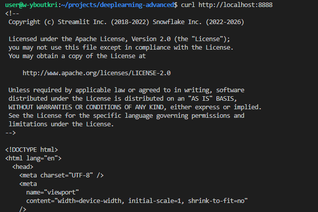

# TP1

## 1

### c

le lien du dépot : https://github.com/Younnnsss
endroit d'exécution : slurm

└── TP1
    ├── data
    │   └── images
    ├── outputs
    │   ├── logs
    │   └── overlays
    ├── README.md
    ├── report
    │   └── report.md
    ├── requirements.txt
    └── src
        ├── app.py
        ├── geom_utils.py
        ├── sam_utils.py
        └── viz_utils.py

### e

Résultat de la commande : 
torch 2.10.0+cu128
cuda_available True
device_count 1

### g

yboutkrida@arcadia-slurm-node-1:~$ python -c "import streamlit, cv2, numpy; print('ok'); import segment_anything; print('sam_ok')"
ok
sam_ok

### i

port choisi : 8888

UI accessible via SSH tunnel : oui
