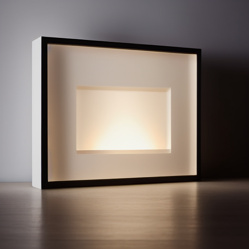
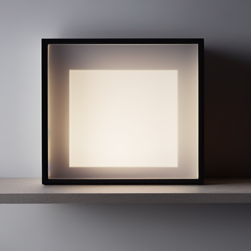
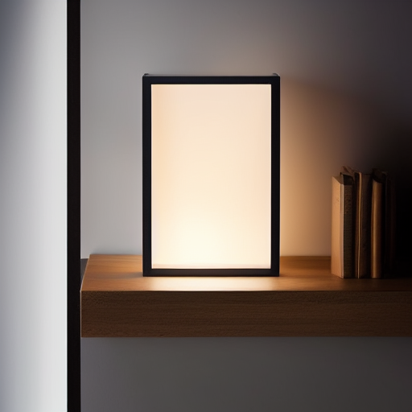
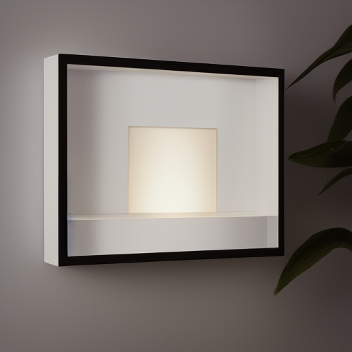
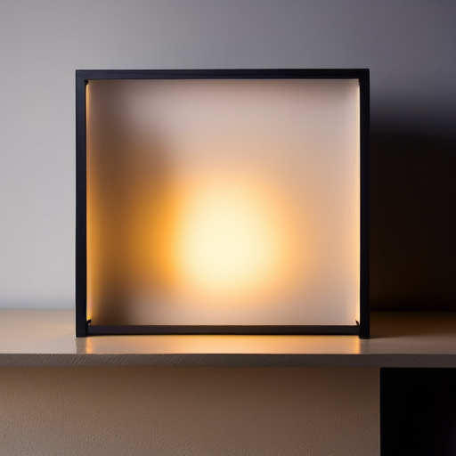
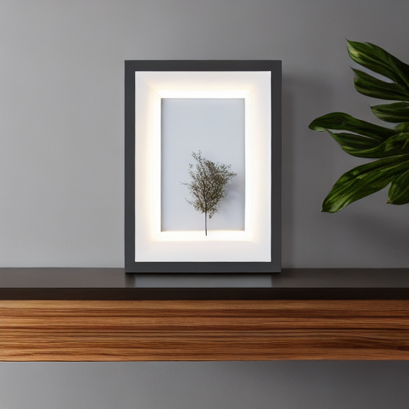
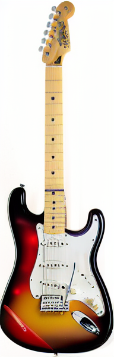
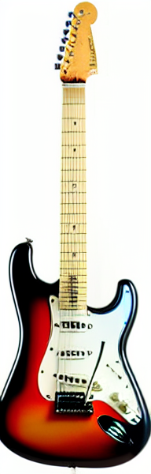

# TP2 

## 1 

Tout a fonctionné parfaitement du premier coup ! 

## 2

CONFIG: {'model_id': 'stable-diffusion-v1-5/stable-diffusion-v1-5', 'scheduler': 'EulerA', 'seed': 42, 'steps': 30, 'guidance': 7.5}

## 3

| Expérience | Image | Paramètre Clé |
| :--- | :---: | :--- |
| **01. Baseline** |  | EulerA, 30 steps, G=7.5 |
| **02. Steps Bas** |  | 15 steps (Rapide) |
| **03. Steps Haut** |  | 50 steps (Précis) |
| **04. Guidance Bas** |  | G=4.0 (Libre) |
| **05. Guidance Haut** |  | G=12.0 (Strict) |
| **06. Scheduler** |  | DDIM (Différent) |

La variation du nombre d'étapes révèle une différence notable dans la qualité des images générées. À 15 steps, les couleurs et lumières sont imparfaites, les jantes manquent de netteté et les logos sont peu détaillés. En augmentant à 50 steps, ces éléments deviennent bien définis, mais les phares présentent un effet de tourbillon. Avec une guidance de 4, l'image est réaliste avec des détails maîtrisés. En revanche, une guidance élevée (12) donne un rendu moins naturel, avec un style plus cartoonesque. Le scheduler DDIM entraîne une inversion de la position de la voiture, une texture trop lisse et une perte de réalisme dans les détails, notamment avec un fond modifié par rapport à la baseline.

## 4 

Image source (avant) :

Résultats :

- strength = 0.35  

- strength = 0.60  

- strength = 0.85  

Les structures et formes globales demeurent constantes entre strength 035 et 085, mais les couleurs changent particulièrement. A 60 seul les couleurs sont modifié alors qu'à 85 c'est même la matière de la guitare qui a l'air différente (mais bizarrement les couleurs sont plus fidèle)

Le résultat est peu concluant, dès que la réalisation demande de la créativité, l'IA a été incapable de produire un résultat utilisable.

## 5

## 6

| Critères | Image #1 (Baseline) | Image #2 (Extreme) | Image #3 (I2I Strength Haut) |
| :--- | :---: | :---: | :---: |
| **Prompt adherence** (Fidélité au texte) | 1 | 2 | 0 |
| **Visual realism** (Réalisme photo) | 2 | 2 | 0 |
| **Artifacts** (2 = aucun défaut gênant) | 2 | 2 | 0 |
| **E-commerce usability** (Potentiel commercial) | 2 | 2 | 0 |
| **Reproducibility** (Paramètres complets) | 2 | 2 | 2 |
| **TOTAL / 10** | **7 / 10** | **9 / 10** | **3 / 10** |

Image très réaliste, proche de qualité photographique. Convient presque parfaitement pour une publication.

Image super réaliste très proche du prompt originel répond à toutes les attentes, très convaincant.

Pas du tout convaincant mais cela demandais un gros effort de créativité, on a largement dépassé les capacités de l'IA

Les paramètres influencent un compromis clair qualité vs latence/coût : augmenter num_inference_steps ou choisir certains schedulers améliore parfois la netteté et la stabilité, mais augmente linéairement le temps de génération et donc le coût GPU. À l’inverse, réduire steps accélère mais dégrade souvent les détails et augmente les artefacts.
La reproductibilité dépend au minimum du couple, de la seed, des steps, du guidance, de la résolution. Elle peut casser si la version des librairies change, si le modèle est mis à jour côté hub, ou si on ne fixe pas correctement le générateur.
En e-commerce, les risques principaux sont les hallucinations, des images trompeuses, et la conformité. Pour limiter ces risques, je privilégierais strength modéré, j’ajouterais des filtres, un contrôle humain, et je n’autoriserais la publication que sur des images validées ou retouchées, avec traçabilité complète des configs.
