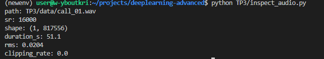
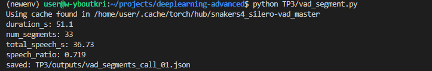
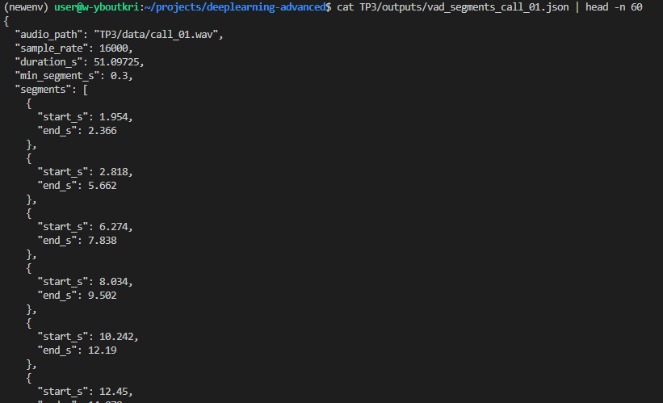
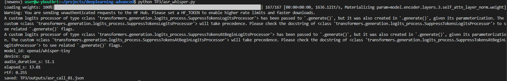
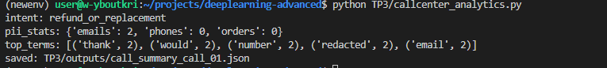
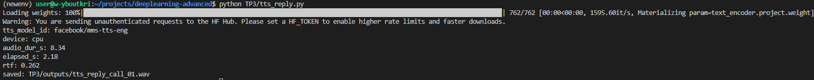
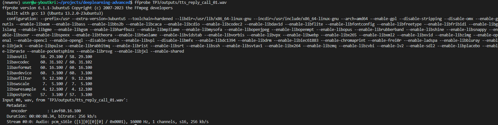
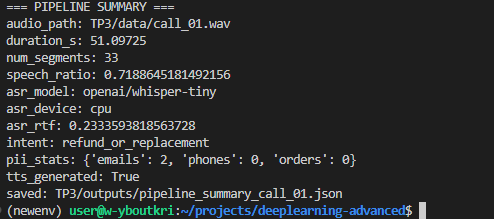

# TP3 — Deep learning pour l'audio : pipeline call center

## 1

### c 


## 2

### b 


### e




## 3

### b 





### c

Le ratio de 71.9% est cohérent : le texte est lu de manière continue avec des pauses naturelles entre les phrases. Les 33 segments reflètent bien les silences entre chaque phrase. On observe beaucoup de micro-segments dans la zone de l'épellation (segments 11–17 pour le numéro de commande, segments 26–31 pour le téléphone), ce qui est attendu car le VAD détecte chaque chiffre prononcé individuellement comme un segment distinct.

### d 

En passant de 0.30 à 0.60, `num_segments` passe de 33 à 23 et `speech_ratio` diminue légèrement car les segments courts (chiffres épelés < 0.6s) sont filtrés.

## 4

### b



### c

```json
[
  {"segment_id": 0, "start_s": 1.954, "end_s": 2.366, "text": "Hello?"},
  {"segment_id": 1, "start_s": 2.818, "end_s": 5.662, "text": "Thank you for calling customer support."},
  {"segment_id": 2, "start_s": 6.274, "end_s": 7.838, "text": "My name is Alex."},
  {"segment_id": 6, "start_s": 14.402, "end_s": 17.118, "text": "The package was delivered yesterday."},
  {"segment_id": 7, "start_s": 17.346, "end_s": 18.75, "text": "but the screen is cracked."}
]
```

> Hello? Thank you for calling customer support. My name is Alex. And I would have put today. I'm cutting about another. that the row is damaged. The package was delivered yesterday. but the screen is cracked. I would like to refund. [...]

### d 

La segmentation VAD aide globalement la transcription en évitant que Whisper « dérive » sur les silences. Cependant, elle crée des problèmes pour les identifiants épelés et les  segment court. par exemple : (« I'm cutting about another ») devrait être « I'm calling about an order ». Whisper-tiny manque de capacité pour les segments courts et bruités.


## 5

### b

regex simples :

```
intent: refund_or_replacement
pii_stats: {'emails': 0, 'phones': 0}
```

### e



### 5.c Comparaison et réflexion

Post-traitement : 2 emails détectés (« reach me ») mais le téléphone reste absent car Whisper transcrit « 555 » en « Five. Bye. Five. » — « Bye » bloque la conversion (hors dictionnaire DIGIT_WORDS) et empêche une séquence valide (7+ digits).

Erreurs majeures Whisper impactant les analytics :
1. **Segments courts** : « And I would have put today » au lieu de « and I will help you today » (segment 3) → routage potentiel faussé.
2. **Mots-clés critiques** : « I'm cutting about another » au lieu de « I'm calling about an order » → perte de « order » diminue `delivery_issue`.
3. **PII mal transcrits** : « Bye » au lieu de « Five » (segment 27) → faille possible pour données sensibles.

---

## 6

### b



### c



### d 

L'audio MMS-TTS est clair : les mots clés (« replacement », « refund », « preferred option ») sont bien entendus. La prosodie est monotone avec peu de variations naturelles. Pas d'artefacts ou coupures. Le RTF (0.25) est rapide et adapté au temps réel. Acceptable pour une réponse automatique, moins pour un dialogue naturel.


## 7


### b 



### 7.c Engineering note

Goulet d'étranglement (temps) : Whisper-tiny est l'étape la plus lente. VAD et analytics sont quasi instantanés. TTS est rapide, supportant le temps réel. Sur GPU, Whisper serait nettement accéléré.


Étape la plus fragile (qualité) : Whisper-tiny est limité et génère des erreurs sur les segments courts (« I would have put today » → « I will help you today ») et les identifiants épelés. Ces erreurs affectent directement les analytics. VAD aggrave les micro-segments, compliquant la transcription.


Améliorations concrètes :
1. Passer à whisper-small/base : meilleure qualité sur segments courts et épelés pour une latence acceptable sur GPU.
2. Fusionner micro-segments VAD : donner plus de contexte pour réduire les erreurs
