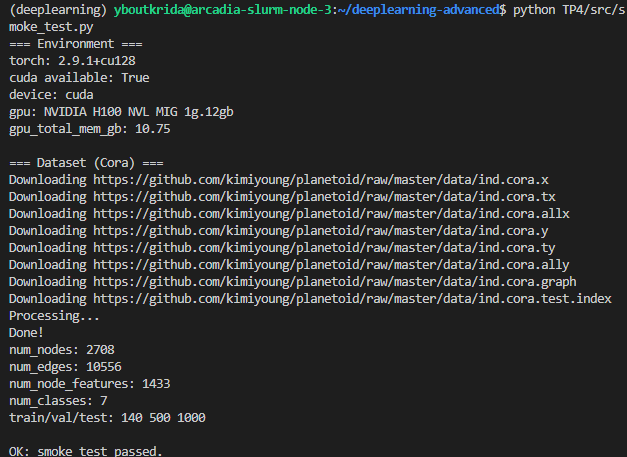

# Exercice1

## A 

(env) user@w-yboutkri:~/projects/deeplearning-advanced$ tree -L 3 TP4
TP4
├── config
│   ├── baseline_mlp.yaml
│   ├── gcn.yaml
│   └── sage_sampling.yaml
├── rapport.md
└── src
    ├── smoke_test.py
    └── utils.py

3 directories, 6 files

## E

# Exercice2

### G

Les métriques des 3 datasets sont calculées séparément afin de s'assurer qu'il n'y ait pas de fuite de données, comme un entraînement du modèle sur les données de test. Cela permet également d'évaluer si le modèle généralise bien ou s'il sur-apprend les données de validation.
