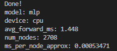
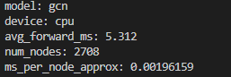

# Exercice1

## A 

(env) user@w-yboutkri:~/projects/deeplearning-advanced$ tree -L 3 TP4
TP4
├── config
│   ├── baseline_mlp.yaml
│   ├── gcn.yaml
│   └── sage_sampling.yaml
├── rapport.md
└── src
    ├── smoke_test.py
    └── utils.py

3 directories, 6 files

## E

# Exercice2

## G

Les métriques des 3 datasets sont calculées séparément afin de s'assurer qu'il n'y ait pas de fuite de données, comme un entraînement du modèle sur les données de test. Cela permet également d'évaluer si le modèle généralise bien ou s'il sur-apprend les données de validation.

## H

# Exercice3

## E 

## F

Le GCN surpasse nettement le MLP sur le dataset Cora, présentant une amélioration de 23 %, car il intègre la structure du graphe plutôt que d'analyser chaque document isolément. Ce dataset présente une forte homophilie, indiquant que les articles reliés par des citations traitent fréquemment du même sujet. Le GCN exploite les informations des voisins pour affiner et compléter les caractéristiques textuelles parfois partielles. Il s'appuie sur le contexte relationnel du graphe pour pallier les insuffisances lorsque les mots clés d'un document ne suffisent pas pour une classification précise.

# Exercice4

## E 

## F

Le neighbor sampling est principalement utilisé pour limiter l'explosion combinatoire en restreignant le nombre de voisins explorés grâce au fanout. Cela permet d'effectuer l'entraînement sur des mini-batchs de taille fixe au lieu de charger l'intégralité du graphe en mémoire, ce qui rend le processus d'entraînement plus rapide. Cependant, il est essentiel de surveiller l'impact sur le CPU lors de la génération des sous-graphes.

En revanche, le tirage aléatoire des voisins introduit inévitablement du bruit dans l'estimation du gradient, augmentant la variance de l'apprentissage. Cela affecte particulièrement les noeuds hubs, car une grande partie de leurs connexions est ignorée. En définitive, il s'agit d'un compromis entre la scalabilité sur des datasets volumineux et la précision optimale que fournirait un GCN complet.

# Exercice5

## D

| Modèle | avg_forward_ms | ms_per_node_approx |
| :--- | :---: | :---: |
| MLP | 1.448 | 0.00053471 |
| GCN | 5.312 | 0.00196159 |
| GraphSAGE | 2.345 | 0.00053465 |

## E

Le warmup sert à éviter de prendre en compte les lenteurs liées au premier passage. Lors de l'initialisation, le GPU configure ses kernels et alloue sa mémoire, ce qui entraîne un temps d'exécution plus élevé. En effectuant plusieurs itérations préliminaires, on garantit que la mesure des performances reflète l'état stable du modèle.

La synchronisation CUDA est nécessaire à cause du fonctionnement asynchrone du GPU. Le CPU transmet les instructions au GPU et continue ses opérations sans attendre la fin des calculs. Sans synchronisation, le chronomètre n'enregistrerait que le temps de transmission des commandes et non celui des calculs. En imposant une synchronisation avant et après, le CPU est contraint d'attendre la fin effective des calculs pour capturer des mesures précises.

# Exercice6

## B

| Modèle | test_acc | test_macro_f1 | total_train_time_s | train_loop_time | avg_forward_ms |
| :--- | :---: | :---: | :---: | :---: | :---: |
| MLP | 0.5800 | 0.5659 | 1.7995 | 2.2524 | 0.0507 |
| GCN | 0.8140 | 0.8101 | 0.8195 | 1.0114 | 0.7643 |
| GraphSAGE | 0.7870 | 0.7860 | 0.6937 | 0.9560 | 0.3592 |

## C

Du point de vue de l'ingénierie, le choix repose sur un équilibre entre précision et contraintes de ressources. Si l'objectif principal est la performance maximale, le GCN se distingue avec une accuracy de 0.8140 en exploitant les relations du graphe. Cependant, pour des applications sensibles à la latence (ex: interactions temps réel), le MLP est idéal grâce à son temps d'inférence ultra-rapide (0.05 ms), bien que cela se fasse au détriment de la précision (-23% d'accuracy).

Pour les cas d'utilisation à grande échelle impliquant de vastes graphes, GraphSAGE est un choix judicieux. Il combine efficacité et scalabilité : son inférence (0.35 ms) est deux fois plus rapide que celle du GCN, son entraînement est le plus rapide (0.69 s), et il offre une précision proche de celle du GCN (0.7870 d'accuracy). Cette méthode équilibre performances et adaptabilité pour des systèmes distribués ou volumineux.

## D

Un facteur clé pouvant biaiser cette comparaison est l'absence de contrôle strict sur les seeds aléatoires. Étant donné que l'initialisation des réseaux de neurones dépend fortement du hasard, une seed particulière pourrait avantager un modèle moins performant de manière aléatoire. Dans un contexte professionnel, il serait recommandé d'effectuer une validation croisée (K-Fold) ou d'évaluer les modèles sur 5 à 10 exécutions avec différentes seeds afin d'assurer que les résultats sont statistiquement significatifs et reproductibles.

Il est également essentiel de maintenir une uniformité dans l'environnement d'évaluation. Par exemple, comparer un MLP tournant sur CPU à un GCN s'exécutant sur GPU ne serait pas pertinent. Dans ce cas précis, toutes les mesures ont été réalisées sur CUDA avec un préchauffage (warmup), réduisant les distorsions engendrées par les phases d'initialisation du matériel.

## E

Le dépôt est organisé et n'inclut que les éléments essentiels, tels que le rapport, les scripts, et les fichiers de configuration. Aucun fichier lourd, comme les datasets, checkpoints (.pt) ou logs massifs, n'a été ajouté aux commits.
