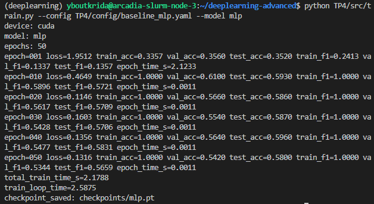
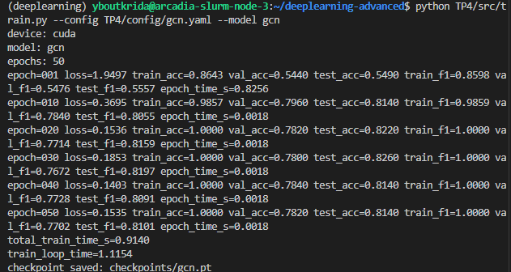

# Exercice1

## A 

(env) user@w-yboutkri:~/projects/deeplearning-advanced$ tree -L 3 TP4
TP4
├── config
│   ├── baseline_mlp.yaml
│   ├── gcn.yaml
│   └── sage_sampling.yaml
├── rapport.md
└── src
    ├── smoke_test.py
    └── utils.py

3 directories, 6 files

## E

# Exercice2

## G

Les métriques des 3 datasets sont calculées séparément afin de s'assurer qu'il n'y ait pas de fuite de données, comme un entraînement du modèle sur les données de test. Cela permet également d'évaluer si le modèle généralise bien ou s'il sur-apprend les données de validation.

## H

# Exercice3

## E 

## F

Le GCN surpasse nettement le MLP sur le dataset Cora, présentant une amélioration de 23 %, car il intègre la structure du graphe plutôt que d'analyser chaque document isolément. Ce dataset présente une forte homophilie, indiquant que les articles reliés par des citations traitent fréquemment du même sujet. Le GCN exploite les informations des voisins pour affiner et compléter les caractéristiques textuelles parfois partielles. Il s'appuie sur le contexte relationnel du graphe pour pallier les insuffisances lorsque les mots clés d'un document ne suffisent pas pour une classification précise.

