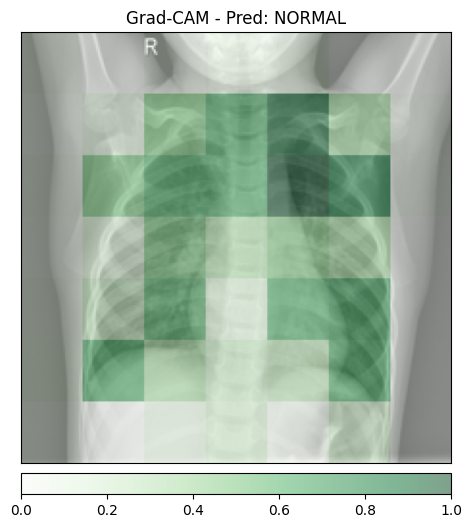
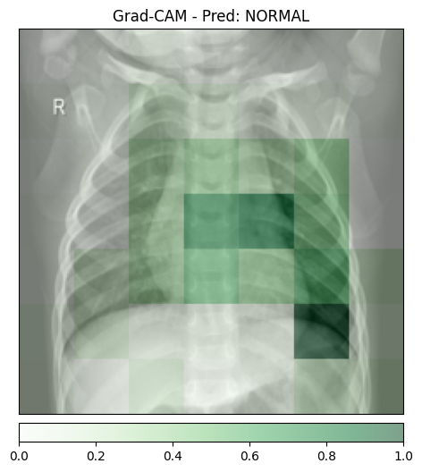
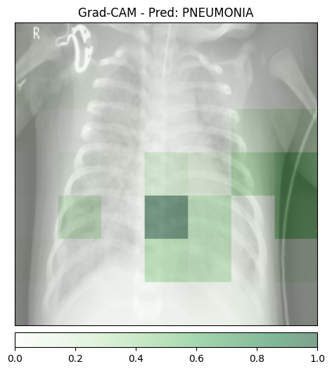
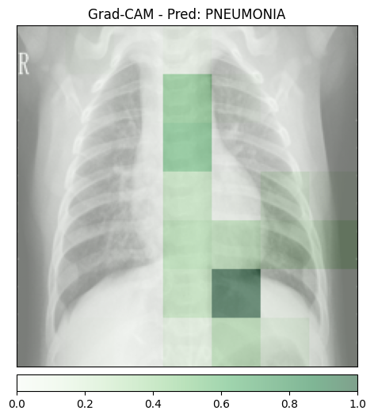
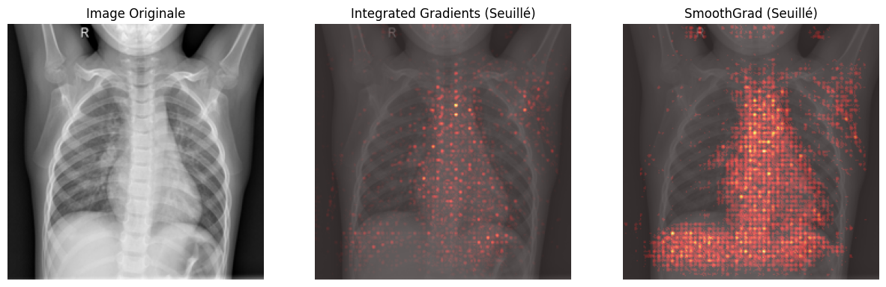
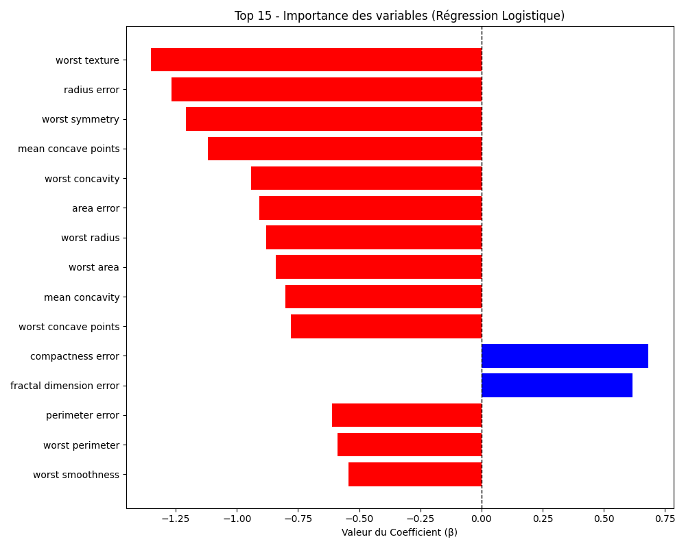
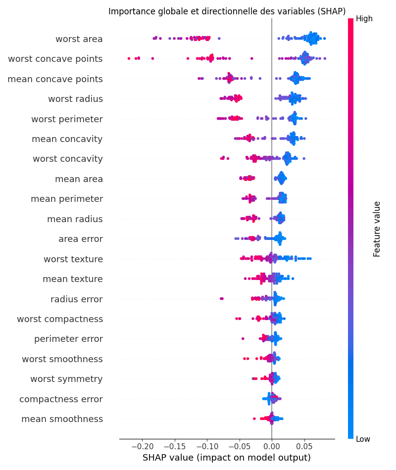

# TP6

## 1 

### d

Les radios normales sont classées comme normales, et les pneumonies comme pneumonies, le modèle donne les résultats attendus.
Cependant, un effet clever hans apparaît, le modèle utilise surtout la colonne vertébrale pour détecter la pneumonie, tandis qu'il se concentre sur les poumons pour les radios normales.
Les explications utilisent de grands pixels, cela vient de la basse résolution dans les couches profondes, où un pixel correspond à une zone agrandie dans l'image finale.

## 2

### b

(env) user@w-yboutkri:~/projects/deeplearning-advanced$ python TP6/02_ig.py                                                                                                                         
Analyse fine au pixel sur : TP6/img/normal_1.jpeg
Warning: You are sending unauthenticated requests to the HF Hub. Please set a HF_TOKEN to enable higher rate limits and faster downloads.
Loading weights: 100%|███████████████████████████████████████████████████████████████████████████████████████████████████████████████████████████████████████████████████████████| 320/320 [00:00<00:00, 6106.55it/s]
/home/user/projects/deeplearning-advanced/env/lib/python3.12/site-packages/captum/attr/_utils/batching.py:51: UserWarning: Internal batch size cannot be less than the number of input examples. Defaulting to internal batch size of 100 equal to the number of examples.
  warnings.warn(
Temps IG pur : 4.1991s
Temps SmoothGrad (IG x 100) : 546.1437s
Visualisation sauvegardée dans ig_smooth_normal_1.png

Integrated Gradients prend 1 seconde, Smooth Grad 14 secondes : pas d'analyse en temps réel possible. GradCAM est efficace et instantané pour détecter les maladies. Si une latence de 1 seconde est acceptable, Integrated Gradients est plus précis, avec Smooth Grad pour une analyse détaillée post-observation.

Les features négatives (< 0) aident le modèle à éviter une décision incorrecte en mettant en avant des caractéristiques opposées à la pneumonie.

## 3

### c

Le glassbox montre que les 3 caractéristiques principales sont : worst_textures, radius_error et worst_symmetry. Ce modèle interprétable améliore la compréhension en fournissant des données précises, pas seulement des zones d'intérêt comme avec les cartes de chaleurs.

## 4

### 

Les caractéristiques influençant la décision finale diffèrent de celles détectées par la Régression Logistique, leur robustesse est faible.

Pour le patient 0, shap waterfall montre que le critère principal est worst area (677.9).
